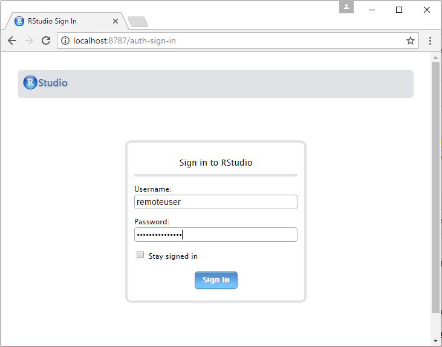

# This repository has content for the AI Immersion Workshop tutorial "Tools for scaling R on Azure".

## Tutorial link (AI Immersion Workshop, May 2017)
[https://aiimmersion.eventcore.com/agenda#/192939](https://aiimmersion.eventcore.com/agenda#/192939)

## Tutorial Prerequisites
* Please bring a wireless enabled laptop.
* Make sure your machine has an ssh client with port-forwarding capability. On Mac or Linux, simply run the ssh command in a terminal window.
On Windows, download [plink.exe](https://the.earth.li/~sgtatham/putty/latest/x86/plink.exe)
from [http://www.chiark.greenend.org.uk/~sgtatham/putty/download.html](http://www.chiark.greenend.org.uk/~sgtatham/putty/download.html).

## Connecting to the Data Science Virtual Machine (with Spark 2.0.2) on Microsoft Azure
We will provide Azure Data Science Virtual Machines (running Spark 2.0.2) for attendees to use during the tutorial. You will use your laptop to connect to your allocated virtual machine.

1. Connect to your DSVM
    * __Linux, Mac__: Command line to connect with ssh - replace XXX with the public IP address of your Data Science Virtual Machine [e.g. remoteuser@13.64.107.209]
    ```bash
    ssh -L localhost:8787:localhost:8787 remoteuser@XXX
    ```
    * __Windows__: Command line to connect with plink.exe - run the following commands in a Windows command prompt window - replace XXX with the public IP address of your Data Science Virtual Machine [e.g. remoteuser@13.64.107.209]
    ```bash
    cd directory-containing-plink.exe
    .\plink.exe -L localhost:8787:localhost:8787 remoteuser@XXX
    ```
    We are createing an SSH tunnel to the VM by mapping localhost:8787 on the VM to the client machine. This is the port on the VM opened to RStudio Server.

    

2. Once you are connected, become a root user on the cluster. In the SSH session, use the following command.

    ```bash
    sudo su -
    ```

3. Download the custom script to install all the prerequisites. Use the following command.

    ```bash
    wget https://raw.githubusercontent.com/Microsoft/AI-Immersion-Workshop/master/Applied%20Machine%20Learning%20for%20Developers/R%20server%20Tools%20for%20scaling%20R%20using%20Azure/scripts/DSVM_Customization_Script.sh
    ````


4. Change the permissions on the custom script file and run the script. Use the following commands.

    ```bash
    chmod +x DSVM_Customization_Script.sh
    dos2unix ./DSVM_Customization_Script.sh
    ./DSVM_Customization_Script.sh
    ```
5. After connecting via the above command lines, open a web browser and open the following URL to connect to RStudio Server on your Data Science Virtual Machine<br>

    ```bash
    http://localhost:8787/ 
    ```

    

<hr>

## Suggested Reading prior to tutorial date

### SparkR (Spark 2.0.2): <br>
SparkR general information: http://spark.apache.org/docs/latest/sparkr.html
<br>
SparkR 2.0.2 functions: https://spark.apache.org/docs/2.0.2/api/R/index.html

### RevoScaleR: <br>
RevoScaleR functions: https://msdn.microsoft.com/en-us/microsoft-r/scaler/scaler

### Microsoft R Server: <br>
Microsoft R Server general information: https://msdn.microsoft.com/en-us/microsoft-r/rserver. <br>
Microsoft R Servers are installed on both Azure Linux DSVMs and HDInsight clusters (see below), and will be used to run R code in the tutorial.

### R-Server Operationalization service: <br>
Microsoft R Server operationalization service general information: https://msdn.microsoft.com/en-us/microsoft-r/operationalize/about
<br>
Configuring operationalization: https://msdn.microsoft.com/en-us/microsoft-r/operationalize/configuration-initial

<hr>

## Platforms & services for hands-on exercises or demos
### Azure Linux DSVM (Data Science Virtual Machine)
Information on Linux DSVM: https://azuremarketplace.microsoft.com/en-us/marketplace/apps/microsoft-ads.linux-data-science-vm<br>
The Linux DSVM has Spark (2.0.2) installed, as well as Yarn for job management, as well as HDFS. So, you can use the DSVM to run regular R code as well as code that run on Spark (e.g. using SparkR package). You will use DSVM as a single node Spark machine for hands-on exercises. We will provision these machines and assign them to you at the beginning of the tutorial.<br>
