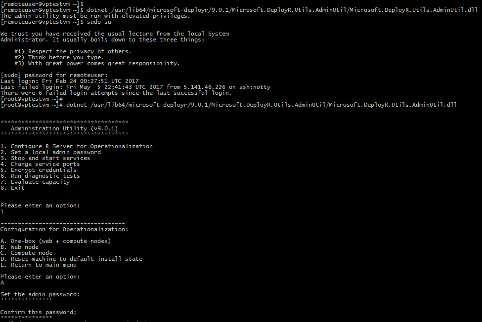

# Configuring R Server for Operationalization

We will start this session by configuring Microsoft R Server for operationalization. Detailed instructions on this and more information can be found [here](https://msdn.microsoft.com/en-us/microsoft-r/operationalize/configuration-initial). Following are a short set of instructions.

1. Connect to your DSVM via ssh (replace XXX with your VM's public IP address)
    
    ```bash
    ssh remoteuser@XXX
    ```
    
2. Once you are connected, become a root user on the cluster. In the SSH session, use the following command.

    ```bash
    sudo su -
    ```

3. Launch administration utility script that comes with Microsoft R Server, that will take you through the configuration.

    ```bash
    dotnet /usr/lib64/microsoft-deployr/9.0.1/Microsoft.DeployR.Utils.AdminUtil/Microsoft.DeployR.Utils.AdminUtil.dll
    ````
4. From the main menu, to choose the option __Configure R Server for Operationalization__ (enter 1).

5. From the main menu, choose __One-box (web + compute nodes)__ (enter A).

6. Set and confirm the admin password. Note that the username for connected to the R Server is set to __admin__ by default.

7. After submitting your password, you should see Success message for starting web and compute nodes.
    ```bash
    Success! Web node running (PID: 7123)
    Success! Compute node running (PID: 7123)
    ```

The process of launching the Admin Utility is shown in the following figure.




